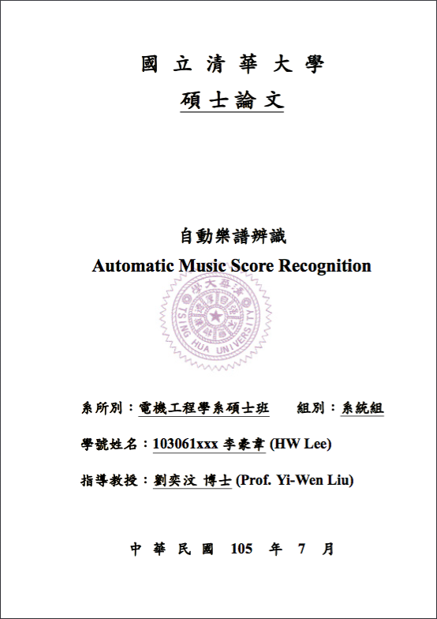

# 國立清華大學碩博士論文 XeLaTeX 模板

## 前言
本模板改寫自 [Tz-Huan Huang](http://www.csie.ntu.edu.tw/~tzhuan/www/) 撰寫的 [臺灣大學碩博士論文 XeLaTeX 模版](https://github.com/tzhuan/ntu-thesis)，使此模板適用於清大碩博士論文。（目前針對電機所系統組適用，其他系所可能得額外詢問）

## 說明
請參考原作者所提供之 [wiki](https://github.com/tzhuan/ntu-thesis/wiki) 文件。

## 範本架構

```
.
├── Makefile             <-- 編譯工具
├── README.md            <-- 文件
├── abstract.tex         <-- 摘要範例
├── acknowledgements.tex <-- 致謝範例
├── figsrc               <-- 圖片放置資料夾
│   ├── DnC.png
│   ├── bookspine.png
│   └── watermark.pdf
├── introduction.tex     <-- 章節範例
├── nthuthesis.cls       <-- 模板設定
├── nthuvars.tex         <-- 參數設定
├── omr-overview.tex     <-- 章節範例
├── thesis.bib           <-- 參考資料
└── thesis.tex           <-- 論文主文
```

## 與原版本差異
* 範本主文 `thesis.tex`

	```
	\documentclass{nthuthesis}
	
	\usepackage{times}
	...
	```
	
	新增圖片資料夾結構 `./figsrc/` 供圖片放置，以及字型上的設置筆記。
	
	```
	% declare the path(s) where your graphic files are
	\graphicspath{{./figsrc/}}
	% and their extensions so you won't have to specify these with
	% every instance of \includegraphics
	\DeclareGraphicsExtensions{.pdf,.jpeg,.png}
	```
	
	對於字型設置上，每台電腦上字型的名字不一，因此直接使用原版的 `\setmainfont{Times New Roman}` 以及 `\setCJKmainfont{標楷體}` 可能會失敗。因此建議在終端機上使用 `fc-list :outline -f "%{family}\n"` 先查詢自己的機器上有哪些字型以免編譯錯誤。
	
	```
	% Set the default fonts
	
	% English font
	% Note: please refer to 'fc-list :outline -f "%{family}\n"' for choosing a valid font name
	\setmainfont{Times New Roman}
	
	% Chinese font
	% Note: please refer to 'fc-list :outline -f "%{family}\n"' for choosing a valid font name
	\setCJKmainfont[AutoFakeBold=3,AutoFakeSlant=.4]{Kaiti TC}
	\defaultCJKfontfeatures{AutoFakeBold=6,AutoFakeSlant=.4}
	```

* 模板 `nthuthesis.cls`

	調整封面頁 `\makecover` 以及新增授權頁 `\makecopyright`。封面如下：
	

* 浮水印直接放置在 `./figsrc/watermark.pdf`

## 小提醒

* 編譯指令

	在 `make` 下，僅檢查 `*.tex` 相關的原始碼是否有更動，因此若是只有更動其他檔案（例如 `*.png`）是不會重新編譯的。為了避免此麻煩，我一般習慣直接使用 `make -B`。而很多中間產生的檔案也都滿礙事的，所以最後都會加上 `make clean`，整個指令合起來就是 `make WATERMARK=1 -B && make clean`。

## 聯絡

[Hao-Wei Lee](mailto:tony123930@yahoo.com.tw)